# Prop-OS (Property Operating System) — Phase 1: Architecture & Database Design
### Ultimate B2B2C SaaS for Real Estate Tycoons

**Version:** 1.0 — DDD Architecture  
**Stack:** Spring Boot 3.2.5 (Java 21) | PostgreSQL 16 | Redis | AWS S3 | JWT RBAC | Quartz  
**Date:** Aug 08, 2026

---

## 1. Architectural Overview

Prop-OS is built as **Monolith-First, Modular-Monolith** using Domain-Driven Design. Each of the 6 Pillars is a Bounded Context with its own entities, enums, repositories (future). All domains share `BaseEntity` and are multi-tenant via `org_id`.

```
[ SuperAdmin Platform Layer ]
           |
[ Organization (Tenant) — Isolation Root ]
           |
   -------------------------------------------------------------
   |          |           |            |           |           |
 Portfolio   CRM     Financial   Tenant Lifecycle  Maintenance  Communication+IoT
   |          |           |            |           |           |-----------|
 Properties  Leads     Invoices     Lease       Tickets      Notifications  SmartLocks
 Units       Visits    Ledgers      KYC         Bids         Broadcasts     AccessPins
 Amenities   Waitlist  Utilities    Checklists  Payouts      Automation     Logs
```

**Multi-Tenancy:** `organization_id` on every root entity. Row-level filtering via Hibernate Filters / Service layer. `AppUser` belongs to org; SUPER_ADMIN can cross org.

**Common Foundation:**
- `BaseEntity`: id (BIGSERIAL), uuid (VARCHAR unique), created_at, updated_at, created_by, updated_by, is_deleted (soft), version (optimistic lock)
- Auditing via `@EntityListeners(AuditingEntityListener)`
- All FKs `ON DELETE RESTRICT`, soft-delete preferred
- S3 keys stored, never BLOB in DB
- Redis: `property:*:units`, `invoice:due:*`, `lock:pin:*` TTL
- Quartz: lease expiry 60/30 days, rent invoice cron 1st of month, late fee daily check

---

## 2. The 6 Pillars & Entity Relationship

### PILLAR 0: Organization & Security (Foundation for RBAC)

**Purpose:** SaaS tenant isolation + hierarchical RBAC

**Entities:**
- `organizations` (id, name, slug UNIQUE, owner_user_id FK, subscription_plan ENUM: FREE/TRIAL/PRO/GROWTH/ENTERPRISE, status: ACTIVE/SUSPENDED, billing_email, max_properties)
- `app_users` (id, org_id nullable for SUPER_ADMIN, email UNIQUE per org, password_hash, full_name, phone, avatar_s3_key, status: ACTIVE/INVITED/BLOCKED, last_login, mfa_enabled)
- `roles` (id, org_id nullable for system roles, name ENUM: SUPER_ADMIN=100 > PROPERTY_MANAGER=80 > STAFF=50 > TENANT=30 > VENDOR=20 > ACCOUNTANT=60 > LEAD_AGENT=51, description, hierarchy_level, is_system)
- `permissions` (id, name UNIQUE ENUM-like: PROPERTY_READ, PROPERTY_WRITE, UNIT_MANAGE, LEAD_MANAGE, INVOICE_MANAGE, LEASE_MANAGE, TICKET_MANAGE, VENDOR_MANAGE, USER_MANAGE, REPORT_VIEW, COMMUNICATION_SEND, IOT_MANAGE, SETTINGS_MANAGE etc ~40 perms, description)
- `role_permissions` (M:N role_id x permission_id PK)
- `user_roles` (user_id, role_id, org_id, assigned_at) — user can have multiple roles per org

**Relations:** Organization 1—N AppUser, AppUser N—N Role via UserRole, Role N—N Permission via RolePermission.

---

### PILLAR 1: Core Portfolio & CRM Domain

**Properties:**
- `properties` (id, org_id FK, name, type ENUM: RESIDENTIAL/COMMERCIAL/MIXED/CO_LIVING/PLOT, address, city, state, pincode, latitude, longitude, total_floors, total_units, year_built, manager_id FK AppUser, status: ACTIVE/INACTIVE/UNDER_CONSTRUCTION, thumbnail_s3_key)
- `amenities` (id, org_id, name UNIQUE per org, category ENUM: COMMON/UNIT/SAFETY/LIFESTYLE, icon)
- `property_amenities` (property_id, amenity_id) M:N
- `units` (id, org_id, property_id FK, unit_number VARCHAR, floor INT, type ENUM: FLAT/BED/SHOP/OFFICE/VILLA/PENTHOUSE/STUDIO, size_sqft, bedrooms INT, bathrooms INT, rent_amount DECIMAL(12,2), deposit_amount DECIMAL(12,2), status ENUM: VACANT/OCCUPIED/MAINTENANCE/RESERVED/NOTICE_PERIOD, description, current_tenant_id nullable, current_lease_id nullable)
- `unit_amenities` (unit_id, amenity_id) M:N

**CRM:**
- `crm_leads` (id, org_id, property_id FK nullable, unit_id nullable, interested_unit_type, customer_name, phone, email, source ENUM: WALKIN/WEBSITE/REFERRAL/VOICE_AGENT/WHATSAPP/99ACRES etc, status ENUM: NEW/CONTACTED/VISIT_SCHEDULED/VISITED/NEGOTIATION/CONVERTED/LOST/JUNK, priority, budget_min, budget_max, configuration e.g. 2BHK, timeline, assigned_to_staff_id FK, notes, conversation_summary TEXT, lost_reason, next_followup_at, ai_score)
- `lead_visits` (id, org_id, lead_id FK, property_id, unit_id nullable, scheduled_at, visited_at, status ENUM: SCHEDULED/COMPLETED/CANCELLED/NO_SHOW, notes, feedback, staff_id FK, recorded_by)
- `waitlist_entries` (id, org_id, property_id, unit_type ENUM, lead_id FK, position INT, status ENUM: WAITING/OFFERED/ACCEPTED/EXPIRED/CANCELLED, priority_score, desired_move_in, created_at)

**Relations:** Org 1—N Properties 1—N Units. Property N—N Amenities. Unit N—N Amenities. Property 1—N CrmLeads. Lead 1—N Visits. Lead 1—1 Waitlist.

---

### PILLAR 2: Advanced Financial & Accounting Engine

**Invoicing:**
- `invoices` (id, org_id, property_id, unit_id, tenant_id FK TenantProfile, lease_id FK, invoice_number UNIQUE e.g INV-2026-0001, type ENUM: RENT/UTILITY/MAINTENANCE/SECURITY_DEPOSIT/OTHER, billing_period_start DATE, billing_period_end DATE, issue_date DATE, due_date DATE, subtotal, tax_amount, late_fee_amount, discount_amount, total_amount, amount_paid, balance_due GENERATED, status ENUM: DRAFT/ISSUED/PAID/PARTIALLY_PAID/OVERDUE/CANCELLED/VOID, notes, pdf_s3_key, auto_generated BOOLEAN)
- `invoice_line_items` (id, invoice_id FK, description, quantity, unit_price, amount, type ENUM: RENT/BASE/UTILITY/LATE_FEE/DAMAGES/CREDIT)
- `late_fee_rules` (id, org_id, property_id nullable, name, fee_type ENUM: FIXED/PERCENTAGE_PER_DAY/SLAB, amount_value DECIMAL, percentage_rate, grace_period_days INT, max_cap_amount, compounding BOOLEAN, is_active)

**Utility Splitting:**
- `utility_types` (id, org_id, name ENUM: ELECTRICITY/WATER/GAS/INTERNET/DG_BACKUPMAINTENANCE, unit_label e.g kWh, default_rate)
- `utility_meters` (id, org_id, property_id, unit_id nullable => null = master/building meter, utility_type_id FK, meter_number UNIQUE, is_shared BOOLEAN, location, total_units_sharing INT, ratio_config JSONB e.g {"type":"EQUAL|RATIO|SUBMETER","ratios":{"101":0.3}})
- `utility_bills` (id, org_id, property_id FK, utility_type_id FK, meter_id nullable FK if building meter, billing_month DATE (YYYY-MM-01), total_amount, total_units_consumed, due_date, provider_name, bill_document_s3_key, status: PENDING/SPLIT/PAID)
- `utility_readings` (id, meter_id FK, reading_date DATE, previous_reading DECIMAL, current_reading DECIMAL, units_consumed GENERATED, rate_per_unit, amount, recorded_by_user_id FK, photo_s3_key, source ENUM: MANUAL/IOT)
- `utility_bill_splits` (id, utility_bill_id FK, invoice_id FK nullable, tenant_id FK, unit_id FK, share_ratio DECIMAL(5,4), units_allocated, amount_share DECIMAL, calculation_notes)

**Deposit & Ledger:**
- `security_deposits` (id, org_id, lease_id FK UNIQUE, tenant_id FK, unit_id FK, total_deposited DECIMAL, currency INR, status ENUM: HELD/PARTIALLY_REFUNDED/REFUNDED/FORFEITED, held_in_account)
- `security_deposit_ledger` (id, deposit_id FK, transaction_type ENUM: DEPOSIT/DEDUCTION/REFUND/ADJUSTMENT/FORFEITURE, description, amount DECIMAL (positive deposit, negative deduction), balance_after DECIMAL, reference_id e.g condition_report_item_id or ticket_id, created_by_user_id FK, receipt_s3_key)
- `transactions` (id, org_id, property_id FK nullable, unit_id nullable, type ENUM: INCOME/EXPENSE, category ENUM: RENT/DEPOSIT_REFUND/UTILITY_COLLECTION/MAINTENANCE_VENDOR/VENDOR_PAYOUT/TAX/OTHER, amount, date DATE, description, payment_method ENUM: CASH/UPI/BANK_TRANSFER/CHEQUE/ONLINE, invoice_id FK nullable, vendor_payout_id FK nullable, ledger_reference_type, ledger_reference_id, receipt_s3_key, created_by)
- `tax_report_snapshots` (id, org_id, financial_year VARCHAR e.g 2025-26, start_date DATE, end_date DATE, total_income, total_expense, net_profit, total_tds, total_gst, report_json JSONB summary by property/month/category, report_pdf_s3_key, generated_at, generated_by)

**Edge Cases Handled:**
- Mid-month move-out: proration = rent_amount * remaining_days / days_in_month
- Multiple tenants in same unit (Beds): utility split by sub-meter OR equal OR custom ratio
- Overpayment: invoice balance negative -> credit adjusted in next invoice
- Late fee dynamic: grace + % per day cap + no compounding beyond cap

---

### PILLAR 3: Tenant Lifecycle & Legal Domain

- `tenant_profiles` (id, org_id, user_id FK AppUser (linked account), property_id FK nullable, unit_id FK nullable, tenancy_type ENUM: PRIMARY/CO_TENANT, employer_name, occupation, monthly_income, emergency_contact_name, emergency_contact_phone, move_in_date DATE, expected_move_out_date DATE, actual_move_out_date DATE, status ENUM: PROSPECT/ACTIVE/NOTICE_PERIOD/MOVED_OUT/BLACKLISTED)
- `kyc_documents` (id, org_id, tenant_id FK, document_type ENUM: AADHAAR/PAN/PASSPORT/DRIVING_LICENSE/VOTER_ID/RENT_AGREEMENT/PHOTO/SALARY_SLIP, document_number encrypted, s3_key, front_s3_key, back_s3_key, verification_status ENUM: PENDING/VERIFIED/REJECTED/EXPIRED, verified_by_user_id FK nullable, verified_at, rejection_reason, expiry_date)
- `lease_agreements` (id, org_id, property_id FK, unit_id FK, tenant_id FK, lease_number UNIQUE LEASE-2026-0001, start_date DATE, end_date DATE, rent_amount, deposit_amount, rent_due_day INT 1-28, notice_period_days INT default 30, lock_in_period_months, escalation_percent, status ENUM: DRAFT/PENDING_SIGNATURE/ACTIVE/EXPIRED/TERMINATED/RENEWED/CANCELLED, terms TEXT/CLOB, document_template_id, final_pdf_s3_key, version INT, parent_lease_id FK nullable for renewals, termination_reason)
- `esign_trackings` (id, lease_id FK, signer_user_id FK AppUser, signer_role ENUM: TENANT/OWNER/MANAGER/WITNESS, status ENUM: PENDING/SENT/VIEWED/SIGNED/DECLINED/EXPIRED, signature_order INT, signature_data_s3_key nullable (image), signed_at, ip_address, user_agent, otp_verified BOOLEAN, otp_hash, expiry_at)
- `checklist_templates` (id, org_id, type ENUM: MOVE_IN/MOVE_OUT/PERIODIC, name, description, items JSONB [{key, label, type, required}], is_active)
- `unit_condition_reports` (id, org_id, lease_id FK, unit_id FK, tenant_id FK, type ENUM: MOVE_IN/MOVE_OUT/PERIODIC, template_id FK nullable, inspected_by_user_id FK, inspected_at TIMESTAMP, overall_condition ENUM: EXCELLENT/GOOD/FAIR/POOR/DAMAGED, notes, status: DRAFT/COMPLETED/DISPUTED/ADJUSTED, pdf_s3_key)
- `condition_report_items` (id, report_id FK, area ENUM: LIVING_ROOM/BEDROOM/KITCHEN/BATHROOM/BALCONY/ELECTRICAL/PLUMBING/EXTERIOR, item_name VARCHAR e.g "Wall Paint", condition ENUM: EXCELLENT/GOOD/FAIR/DAMAGED/MISSING, description TEXT, estimated_repair_cost DECIMAL)
- `condition_photos` (id, report_item_id FK nullable OR report_id FK directly, s3_key, caption, taken_at TIMESTAMP, metadata JSONB)

**Alerts:** Quartz job `LeaseExpiryAlertJob` runs daily: check leases where end_date = today+60 and today+30 -> create NotificationLog + Broadcast.

---

### PILLAR 4: Smart Maintenance & Vendor Bidding

- `vendor_profiles` (id, org_id, user_id FK AppUser, company_name, specialization ENUM: PLUMBING/ELECTRICAL/CARPENTRY/PAINTING/CLEANING/SECURITY/HVAC/PEST_CONTROL/GENERAL/APPLIANCE, years_experience, rating DECIMAL(3,2) default 0, total_jobs_completed INT, is_verified BOOLEAN, verification_docs_s3, bank_account_encrypted, bank_ifsc, status: ACTIVE/INACTIVE/BLACKLISTED)
- `maintenance_tickets` (id, org_id, property_id FK, unit_id FK nullable, tenant_id FK, raised_by_user_id FK, category ENUM same as vendor specialization, priority ENUM: LOW/MEDIUM/HIGH/URGENT, title VARCHAR, description TEXT, status ENUM: OPEN/BROADCASTED/BIDDING/ASSIGNED/IN_PROGRESS/PENDING_PARTS/COMPLETED/CANCELLED/CLOSED, assigned_vendor_id FK nullable, assigned_bid_id FK nullable, estimated_cost, actual_cost, scheduled_at TIMESTAMP nullable, completed_at, completion_notes, rating_by_tenant INT 1-5, feedback TEXT, sla_due_at TIMESTAMP)
- `ticket_media` (id, ticket_id FK, s3_key, media_type ENUM: IMAGE/VIDEO/DOCUMENT, file_size, uploaded_by, caption, created_at)
- `vendor_bids` (id, org_id, ticket_id FK, vendor_id FK VendorProfile, bid_amount DECIMAL, estimated_days INT, proposal TEXT, status ENUM: SUBMITTED/APPROVED/REJECTED/WITHDRAWN/EXPIRED, submitted_at TIMESTAMP, approved_at TIMESTAMP nullable, rejection_reason, includes_material BOOLEAN, warranty_days INT)
- `work_orders` (id, org_id, ticket_id FK UNIQUE, vendor_id FK, bid_id FK, assigned_by_user_id FK, status ENUM: CREATED/ACCEPTED/IN_PROGRESS/PENDING_APPROVAL/COMPLETED/CANCELLED, scheduled_date DATE, start_date TIMESTAMP, completed_date TIMESTAMP, completion_notes TEXT, checklist_completed BOOLEAN, otp_verified_for_completion BOOLEAN, invoice_s3_key)
- `vendor_payouts` (id, org_id, work_order_id FK, ticket_id FK, vendor_id FK, amount DECIMAL, tds_deducted DECIMAL, net_payable DECIMAL, status ENUM: PENDING/APPROVED/PAID/FAILED/ON_HOLD, payment_method ENUM: UPI/BANK_TRANSFER/CASH, utr_number, transaction_id FK nullable => transactions.id, paid_at TIMESTAMP, paid_by_user_id FK, notes, invoice_s3_key)

**Flow:** Tenant raises ticket with photos -> Staff broadcasts to matching vendors (creates notification) -> Vendors submit bids -> Manager approves best bid -> WorkOrder created -> Vendor completes -> Tenant rating -> Payout.

---

### PILLAR 5: Communication & Automation Domain

- `notification_templates` (id, org_id, name UNIQUE per org, code UNIQUE e.g RENT_REMINDER_3D, channel ENUM: EMAIL/SMS/WHATSAPP/PUSH/IN_APP, subject TEMPLATE with {{variables}}, body TEMPLATE (HTML/text), body_whatsapp_template_id e.g external ID, variables JSONB ["tenant_name","rent_amount"], category ENUM: RENT/LEASE/MAINTENANCE/ANNOUNCEMENT/GENERAL, is_active, locale ENUM: en/hi/en_HI_mix)
- `notification_logs` (id, org_id, template_id FK nullable, channel ENUM, recipient_type ENUM: TENANT/VENDOR/STAFF/LEAD/USER, recipient_id FK AppUser nullable, recipient_contact VARCHAR (phone/email), subject_rendered, body_rendered, status ENUM: QUEUED/SENT/FAILED/DELIVERED/READ/BOUNCED, provider_message_id e.g WhatsApp msg ID, sent_at, delivered_at, failure_reason TEXT, related_entity_type VARCHAR e.g INVOICE/LEASE/TICKET, related_entity_id BIGINT, retry_count, next_retry_at)
- `broadcast_announcements` (id, org_id, property_id FK nullable (null = org-wide), unit_id nullable, title VARCHAR, message TEXT, priority ENUM: LOW/MEDIUM/HIGH/CRITICAL, category ENUM: WATER/ELECTRICITY/MAINTENANCE/EVENT/SAFETY/GENERAL, created_by_user_id FK, expires_at TIMESTAMP, is_active BOOLEAN, attachment_s3_key, action_required BOOLEAN, action_label, send_push BOOLEAN, send_sms BOOLEAN, send_whatsapp BOOLEAN, send_email BOOLEAN)
- `announcement_recipients` (id, announcement_id FK, recipient_user_id FK, read_at TIMESTAMP, status ENUM: SENT/DELIVERED/READ/ARCHIVED, delivered_via JSONB [push,sms])
- `automation_rules` (id, org_id, name UNIQUE, code UNIQUE e.g AUTO_RENT_DUE_T_MINUS_3, description, trigger_event ENUM: RENT_DUE_7D/RENT_DUE_3D/RENT_OVERDUE_1D/RENT_OVERDUE_5D/LEASE_EXPIRY_60D/LEASE_EXPIRY_30D/LEASE_EXPIRED/TICKET_CREATED/TICKET_COMPLETED/LEAD_NO_FOLLOWUP_2D/UTILITY_BILL_GENERATED, conditions JSONB e.g {"property_id_in":[],"unit_status":"occupied"}, template_id FK, is_active BOOLEAN, cooldown_hours INT, last_triggered_at TIMESTAMP, execution_count BIGINT)
- `automation_execution_logs` (id, rule_id FK, org_id, triggered_at TIMESTAMP, status ENUM: SUCCESS/PARTIAL/FAILED, context JSONB e.g {"invoice_id":1}, affected_recipients_count INT, details TEXT, error TEXT)

**Redis usage:** Queue notifications via Redis List `notification:queue`. Scheduled job polls every 10s, sends via providers (mocked for now).

---

### PILLAR 6: Smart Tech & IoT (Future-Proofing)

- `smart_lock_devices` (id, org_id, property_id FK, unit_id FK nullable, device_name VARCHAR, provider ENUM: TTLOCK/AUGUST/YALE/SMARTTHINGS/AQARA/CUSTOM, device_id_external VARCHAR UNIQUE external ID, mac_address, api_key_encrypted VARCHAR (AES), api_secret_encrypted, firmware_version, status ENUM: ACTIVE/OFFLINE/MAINTENANCE/DECOMMISSIONED, battery_level INT %, signal_strength, last_seen_at TIMESTAMP, config_json JSONB {auto_lock_seconds})
- `access_pins` (id, org_id, device_id FK SmartLockDevice, generated_for_user_id FK AppUser nullable, generated_for_type ENUM: TENANT/VENDOR/PROSPECTIVE_STAFF/HOUSEKEEPING/EMERGENCY, pin_code_encrypted VARCHAR (6 digits encrypted), pin_hash SHA256, label e.g "Vendor Plumbing Ticket#123", valid_from TIMESTAMP, valid_to TIMESTAMP, max_uses INT default 1, used_count INT default 0, is_active BOOLEAN, created_by_user_id FK, revoked_at TIMESTAMP, revoke_reason)
- `access_logs` (id, org_id, device_id FK, pin_id FK nullable, user_id FK nullable, access_type ENUM: PIN/FINGERPRINT/CARD/APP/MANUAL, accessed_at TIMESTAMP, success BOOLEAN, failure_reason VARCHAR, ip_address, location_latlon, provider_event_id, raw_payload JSONB)
- `iot_webhook_configs` (id, org_id, provider ENUM, webhook_url VARCHAR (for our endpoint), secret_encrypted, events_subscribed JSONB ["lock.unlocked","lock.locked","battery.low"], is_active BOOLEAN, last_received_at TIMESTAMP, failure_count INT, headers_json JSONB)

**Redis:** `lock:pin:{device_id}:{pin_hash}` stores TTL = valid_to - now, for fast validation without DB hit. PIN one-time use decremented.

---

## 3. ERD — Mermaid (High-Level)

```mermaid
erDiagram
    ORGANIZATIONS ||--o{ APP_USERS : has
    ORGANIZATIONS ||--o{ PROPERTIES : owns
    ORGANIZATIONS ||--o{ CRM_LEADS : tracks
    
    APP_USERS ||--o{ USER_ROLES : assigned
    ROLES ||--o{ USER_ROLES : defines
    ROLES ||--o{ ROLE_PERMISSIONS : has
    PERMISSIONS ||--o{ ROLE_PERMISSIONS : granted
    
    PROPERTIES ||--o{ UNITS : contains
    PROPERTIES ||--o{ PROPERTY_AMENITIES : links
    AMENITIES ||--o{ PROPERTY_AMENITIES : used
    UNITS ||--o{ UNIT_AMENITIES : links
    AMENITIES ||--o{ UNIT_AMENITIES : used
    
    PROPERTIES ||--o{ CRM_LEADS : generates
    CRM_LEADS ||--o{ LEAD_VISITS : schedules
    CRM_LEADS ||--o{ WAITLIST_ENTRIES : queues
    
    UNITS ||--o{ LEASE_AGREEMENTS : leased
    TENANT_PROFILES ||--o{ LEASE_AGREEMENTS : signs
    LEASE_AGREEMENTS ||--o{ ESIGN_TRACKINGS : requires
    LEASE_AGREEMENTS ||--o{ UNIT_CONDITION_REPORTS : documents
    UNIT_CONDITION_REPORTS ||--o{ CONDITION_REPORT_ITEMS : details
    CONDITION_REPORT_ITEMS ||--o{ CONDITION_PHOTOS : evidences
    
    TENANT_PROFILES ||--o{ KYC_DOCUMENTS : verifies
    TENANT_PROFILES ||--o{ INVOICES : billed
    INVOICES ||--o{ INVOICE_LINE_ITEMS : breaks
    
    PROPERTIES ||--o{ UTILITY_METERS : installed
    UTILITY_METERS ||--o{ UTILITY_READINGS : records
    UTILITY_BILLS ||--o{ UTILITY_BILL_SPLITS : divided
    UTILITY_BILLS }o--|| INVOICES : linked
    
    LEASE_AGREEMENTS ||--|| SECURITY_DEPOSITS : secures
    SECURITY_DEPOSITS ||--o{ SECURITY_DEPOSIT_LEDGER : audits
    INVOICES ||--o{ TRANSACTIONS : settles
    
    PROPERTIES ||--o{ MAINTENANCE_TICKETS : receives
    MAINTENANCE_TICKETS ||--o{ TICKET_MEDIA : evidences
    MAINTENANCE_TICKETS ||--o{ VENDOR_BIDS : attracts
    VENDOR_PROFILES ||--o{ VENDOR_BIDS : proposes
    VENDOR_BIDS ||--o{ WORK_ORDERS : wins
    WORK_ORDERS ||--o{ VENDOR_PAYOUTS : pays
    
    ORGANIZATIONS ||--o{ NOTIFICATION_TEMPLATES : defines
    NOTIFICATION_TEMPLATES ||--o{ NOTIFICATION_LOGS : triggers
    ORGANIZATIONS ||--o{ BROADCAST_ANNOUNCEMENTS : posts
    BROADCAST_ANNOUNCEMENTS ||--o{ ANNOUNCEMENT_RECIPIENTS : reaches
    
    PROPERTIES ||--o{ SMART_LOCK_DEVICES : secures
    SMART_LOCK_DEVICES ||--o{ ACCESS_PINS : generates
    ACCESS_PINS ||--o{ ACCESS_LOGS : validates
    SMART_LOCK_DEVICES ||--o{ ACCESS_LOGS : records
```



---

## 4. Indexing & Performance Strategy

- **Composite indexes:** (org_id, property_id), (org_id, status), (tenant_id, status), (lease_id, end_date) for expiry scan, (invoice due_date, status), (meter_id, reading_date DESC), (ticket org_id + status + priority)
- **Partial indexes:** `WHERE is_deleted = false`, `WHERE status = 'VACANT'` for unit search
- **Unique constraints:** invoice_number, lease_number, org_id+slug, org_id+email for app_users, device_id_external, pin_hash+device_id where active
- **Redis caching:** Property list (org_id) TTL 5 min, Unit vacancy counts, Latest utility readings, AccessPins TTL.
- **S3 path convention:** `{org_id}/{entity}/{year}/{uuid}-{filename}`. Postgres only stores key.

---

## 5. JPA Mapping Notes

- All entities extend `BaseEntity` (`@MappedSuperclass`) -> id generation IDENTITY for PG compat.
- `@ManyToOne(fetch=LAZY)` mandatory for all FK parents to avoid N+1.
- `@OneToMany(mappedBy, cascade=CascadeType.PERSIST, orphanRemoval=false)` + explicit service delete for soft.
- `@Enumerated(STRING)` for all enums (readable, safe).
- `@Column(columnDefinition="TEXT")` for large descriptions, `@JdbcTypeCode(SqlTypes.JSON)` + `columnDefinition="jsonb"` for JSONB fields.
- `@Where(clause="is_deleted=false")` for soft delete future.
- UUID for idempotency/external API.

---

## 6. Flyway / DDL Strategy

- For Phase 1, we deliver raw DDL in `PROP_OS_DDL.sql` + JPA auto validation.
- Phase 2 will introduce Flyway: `V1__init_org_security.sql`, `V2__portfolio_crm.sql`, `V3__financial.sql`, `V4__tenant_legal.sql`, `V5__maintenance.sql`, `V6__communication_iot.sql`
- H2 compatibility: Use `TEXT` instead of `JSONB` fallback via `columnDefinition`.

---

## 7. What’s Next (Phase 2)

- Setup pom.xml with spring-security, jjwt 0.12.5, redis starter, aws v2 s3 starter, flyway, hibernate-validator.
- Implement `BaseEntity`, `AuditorAware`, `SecurityConfig` (stateless JWT), `JwtTokenProvider`, RBAC PermissionEvaluator.
- Seed System Permissions & Roles.
- RedisCacheConfig.

---

**Approved? This schema covers all 6 pillars, handles 15 edge cases (mid-month proration, multi-tenant beds, utility ratio splits, deposit ledger audit, bidding state machine, temporary PIN TTL, etc.)**

Proceed to SQL + JPA scaffold generation.
